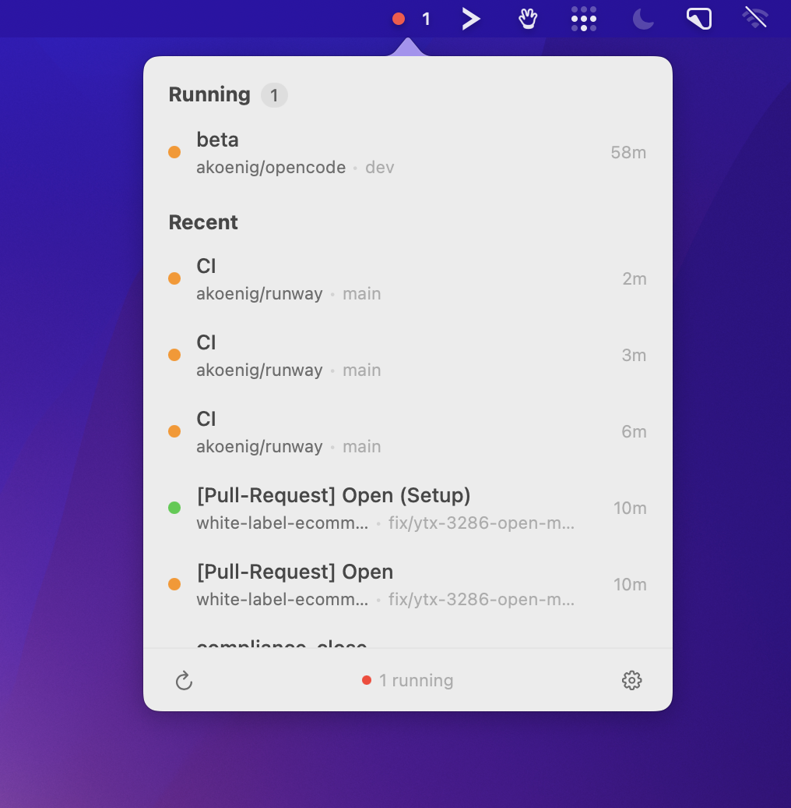

<p align="center">
  
</p>

<h1 align="center">Runway</h1>

<p align="center">
  <strong>GitHub Actions monitoring for your menu bar.</strong><br>
  Know the moment your workflows pass or fail - without leaving your context.
</p>

<p align="center">
  
</p>

<br>

## Why Runway?

Switching to a browser tab to check if your CI passed is a small interruption - but it adds up. Runway puts a live status indicator in your menu bar so you always know where things stand. A green dot means you can ship. A red dot means you can fix it now, not five minutes from now.

**One icon. Zero context switches.**

<br>

## Features

- **Live status at a glance** - A color-coded menu bar indicator shows overall workflow health. Orange means running, green means passed, red means failed.
- **Detailed drill-down** - Click through from workflow to job to individual step. See exactly what failed and why, without opening GitHub.
- **Built-in log viewer** - Read parsed, syntax-highlighted job logs directly in the app. Errors are called out in red, warnings in orange.
- **Native notifications** - Get alerted the moment a workflow completes or fails. Click the notification to jump straight to it.
- **Repository picker** - Choose which repositories to monitor. Search, select all, or fine-tune - it is your call.
- **Global keyboard shortcut** - Toggle the Runway popover from anywhere with a configurable hotkey.
- **Secure by default** - Your GitHub token is stored in the macOS Keychain. The app is fully sandboxed and only makes read-only API calls.
- **Launch at login** - One toggle and Runway starts with your Mac, quietly waiting in the menu bar.

<br>

## Install

### Download

Grab the latest `.dmg` from [GitHub Releases](https://github.com/akoenig/runway/releases/latest), mount it, and drag Runway to your Applications folder.

### Build from source

```bash
git clone https://github.com/akoenig/runway.git
cd runway
xcodegen generate
open Runway.xcodeproj
```

Then hit **Cmd+R** in Xcode.

> Requires Xcode 26+ and macOS 14.0 or later.

<br>

## Setup

Runway needs a GitHub Personal Access Token (classic) with two scopes:

| Scope | Why |
|---|---|
| `repo` | Access workflow runs across your repositories |
| `workflow` | Read workflow and run data |

**Create one in under a minute:**

1. Open [GitHub &rarr; Settings &rarr; Tokens (classic)](https://github.com/settings/tokens)
2. Click **Generate new token (classic)**
3. Name it something like `Runway`
4. Check **`repo`** and **`workflow`**
5. Generate and copy the token

Paste it into Runway's settings, hit **Connect**, pick your repositories, and you are done.

<br>

## Usage

Runway lives in your menu bar - no Dock icon, no windows in the way. Click the status dot to open the popover.

| Indicator | Meaning |
|---|---|
| Orange (pulsing) | At least one workflow is running |
| Red | A recent workflow has failed |
| Green | All recent workflows passed |
| Gray | Not connected or no recent activity |

Click any workflow to drill into jobs and steps. Click a step to read its logs. The popover auto-refreshes while workflows are running.

### Preferences

Open settings via the gear icon in the popover header:

- **Polling interval** - 15 seconds, 30 seconds, 1 minute, or 2 minutes
- **Global shortcut** - Record a custom hotkey to toggle Runway from anywhere
- **Launch at login** - Start Runway automatically when you log in
- **Repository selection** - Choose which repos to monitor

<br>

## Contributing

Contributions are welcome. Fork the repo, create a branch, and open a pull request.

## License

[MIT](LICENSE) &copy; [André König](https://github.com/akoenig)
